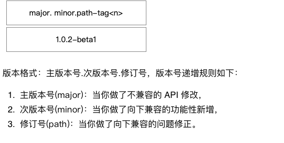
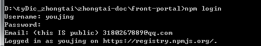

# 流程
## NPM包发布流程
### NPM创建
#### npm是什么
npm 是Node 的模块管理器，功能极其强大。 它是Node 获得成功的重要原因之一。 正因为有了npm，我们只要一行命令，就能安装别人写好的模块。
#### 创建一个node模块
node模块就是发布到npm的代码包， 创建一个新模块的第一步就是创建一个package.json文件， 你可以用npm init来创建package.json文件。
这个过程中命令行会逐步提示你输入这个模块的信息，其中模块的名字和版本号是必填项

你还需要一个入口文件，如果你使用默认值的话，那就会是index.js.创建完package.json文件之后，你就要开始写代码包里的内容了。

####  注册个人npm账号
如果没有npm账号的话，首先去npm官网注册一个npm账号[npm账号注册](https://www.npmjs.com/login)

#### 设置版本号
找到工程中的package.json文件，修改版本号

####  命令行登录
   登录终端输入 npm login 命令，按照提示完成即可**注意要使用官方的镜像源**

####  开始发布
#### npm包实现发布正式版和测试版
+ npm分为组织包和私有包两种形式，目前为止一直发布的是组织包，后续可能会发布私有包，接下来就围绕着组织包的发布进行详述
+ 通常在发正式版本之前，应先发测试版本，测试版本通过之后，再发正式版本

1.在发测试版本时务必将package.json改成这样

    "version": "版本号-beta",

2.然后提交测试版本

    npm publish --tag=beta 注意：在第一次发布组织包测试版本时命令应为npm publish --access public --tag beta

 **注意在发测试版本时以上两个条件缺一不可**

3.下载使用测试版本

    npm install @组织名/包名@beta

1.在发正式版本之前要先更新版本号将package.json改成这样

    "version": "新的版本号"

2.提交正式版本

    npm publish 注意:在第一次发布组织包正式版本时命令应为 npm publish -access public

3.下载使用正式版本

    npm install @组织名/包名

发布过程会把整个目录发布,不想发布的内容模块,可以通过 .gitignore 或 .npmignore 文件忽略

### 更新npm包
当你包的内容修改之后，我们需要更新版本号 npm version <update_type>，update_type就是版本号的意思,会自动更新package.json里面的版本号，然后重新 npm publish,更新就会完成
