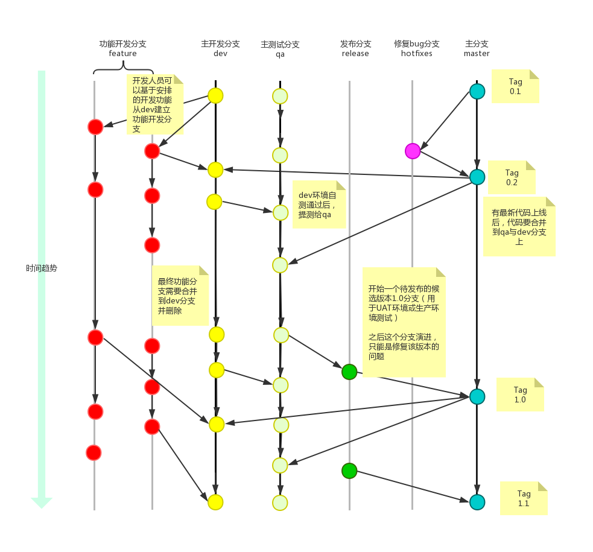

# Git管理规范

## 分支介绍

分支包括主分支（master）、功能开发分支（feature）、主开发分支（dev）、主测试分支（qa）、发布分支（release）、修复分支（hotfixs）。

**开发环境**：功能开发分支（feature）、主开发分支（dev）

**测试环境**：主测试分支（qa）

**预发布环境**：发布分支（release）

**生产环境**：主分支（master）


#### 主分支（master）

所有提供给用户使用的正式版本，都在主分支上发布，主分支为保护分支，不允许直接在主分支上开发，属于生产环境


#### 功能开发分支(feature)

多个人共同开发一个新需求时，每一个人应该从主干分支切出一个功能开发分支，命名为: f_需求名_时间_开发者(如: f_addGrid_20190125_renlq)


#### 主开发分支(dev)

一个新需求被拆分多个模块，由多个开发人员在各自的功能分支上开发，所有开发人员将自己的代码都合并在主开发分支上才能联调；分支名称：dev


#### 主测试分支(qa)

所有的队员将自己的代码都合到主开发分支上，联调成功后，切测试分支交测试人员测试；分支名称：qa


#### 发布分支(release)

测试成功，从主测试分支切一个分支作为发布分支上线；分支名称如:release_v1.0.1、release_v2.1.1


#### 修复bug分支(hotfixs)

线上产品出现bug，从master分支切出一个修复bug分支,修复完成、测试通过后上线，上线完成后删除；分支名称:hotfixs_bug


## Git使用规范流程



## Git修复已发布版本的Bug流程


## 开发流程

#### 新建分支

首先，每次开发新功能，都应该新建一个单独的分支

```
# 获取主干最新代码
$ git checkout master
$ git pull

# 新建一个开发分支myfeature
$ git checkout -b myfeature
```

#### 提交分支commit

分支修改后，就可以提交commit了。

```
$ git add --all
$ git status
$ git commit --verbose
```

git add 命令的all参数，表示保存所有变化（包括新建、修改和删除）。从Git 2.0开始，all是 git add 的默认参数，所以也可以用 git add . 代替。
git status 命令，用来查看发生变动的文件。
git commit 命令的verbose参数，会列出 diff 的结果。

#### 撰写提交信息

每次提交commit必须要有提交注释，注释根据本次提交情况，进行简洁描述。

#### 与主干同步

分支的开发过程中，要经常与主干保持同步。

```
$ git fetch origin
$ git rebase origin/master
```

#### 合并commit

分支开发完成后，很可能有一堆commit，但是合并到主干的时候，往往希望只有一个（或最多两三个）commit，这样不仅清晰，也容易管理。 那么，怎样才能将多个commit合并呢？这就要用到 git rebase 命令。

```
$ git rebase -i HEAD~4  //对最近的 4 个 commit 进行 rebase 操作
```

这时会打开一个如下的互动界面


Commands下6个命令当中，squash和fixup可以用来合并commit，先把需要合并的commit前面的动词，改成fixup（或者f）。

squash：会将当前commit与上一个commit合并；
fixup：与squash相同，但不会保存当前commit的提交信息


完成后，使用 :wq 保存并退出，第三行和第四行的commit都会丢弃，只保留第二行的commit，提交信息只包含这二个commit的提交信息。

#### 推送到远程仓库

合并commit后，就可以推送当前分支到远程仓库了

```
$ git push origin myfeature
$ git push --force origin myfeature  //rebase以后，分支历史改变了，跟远程分支不一定兼容，有可能要强行推送
```

#### 发出Pull Request

提交到远程仓库以后，就可以发出 Pull Request 到master分支，然后请求别人进行代码review，确认可以合并到master。

## 日志规范

#### Commit messages的基本语法

具体格式为:

```
id type： subject
```

id: 禅道ID
type: 本次 commit 的类型，诸如 bugfix docs style 等
subject: 简明扼要的阐述下本次 commit 的内容

Type的类别说明：

feat: 添加新特性
fix: 修复bug
docs: 仅仅修改了文档
style: 仅仅修改了空格、格式缩进、样式等等，不改变代码逻辑
refactor: 代码重构，没有加新功能或者修复bug
perf: 增加代码进行性能测试
test: 增加测试用例
chore: 改变构建流程、或者增加依赖库、工具等

## 注意事项

- 一定要做好GIT配置，如下：

  ```
    $ git config --global user.name "renlq"
    $ git config --global user.email  renlq@example.com
  ```

这样可以从提交历史中看到每次提交人；

- 每个开发人员都应该在自己的开发分支上开发；
- 开发分支合并到公共分支前，必须先更新本地公共分支，在把要合并的公共分支合并到自己的开发分支，完成后在把开发分支合并到公共分支；

例子，开发分支(f_addGrid_20190125_renlq) 要合并到公共分支dev。

步骤：

```
A:f_addGrid_20190125_renlq提交并push；

B:切换到dev分支并更新，保持跟远程仓库一致；

C:切回f_addGrid_20190125_renlq分支，把dev分支的代码合并到此分支；

D:把合并后的 f_addGrid_20190125_renlq 分支合并到dev并push到远程仓库；
```

目的：避免覆盖他人代码；

- 永久存在的分支只有master、dev、发布分支、tag；其他分支在需求上线后删除，保持分支清晰明确；
- 提交代码(commit)时，必须要把此次提交的注释描写清楚；
- master为保护分支，不直接在master上进行代码修改和提交。
- 分支的名称中不使用中划线，应使用下划线，如(f_xxx_yyy，而不是f-xxx-yyy)，这样做的好处是方便拷贝，双击鼠标即能选择名称；
- 代码合并的过程中如果遇到冲突，那么应该由几个人一起来解决这个冲突，这样避免合并出错，引出bug；
- 一定要做.gitignore文件中，过滤除掉个性文件、编译结果、IDE产生的配置 等文件类型，这样避免干扰他人；
- 每次发布生产(master),需要为master打一个tag,方便线上回滚