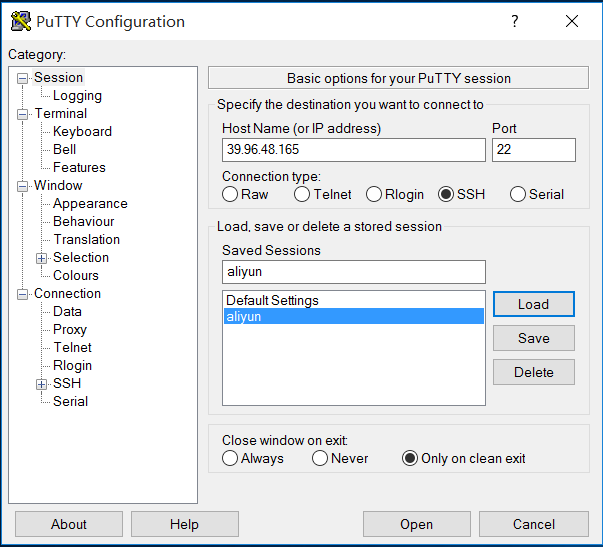

# nginx配置服务器

## 一.准备工作

下载PuTTy软件，远程连接阿里云.

先进入阿里云的远程连接，修改root用户密码

 1. sudo su root 切换到root用户，这样就可以访问root文件夹

 2. root用户下修改密码：passwd ，修改好密码就可以用PuTTy连接了

    

3.输入用户名，密码进入root用户


## 二.开始

### 1.用yum进行安装必要的程序

​		yum -y install gcc gcc-c++ autoconf pcre-devel make automake

​		yum -y install wget httpd-tools vim


## 三.搭建nginx环境

​		查看yum是否已经存在 yum list | grep nginx

​		配置yum源，vim打开 vim /etc/yum.repos.d/nginx.repo

```
[nginx]

name=nginx repo

baseurl=http://nginx.org/packages/centos/7/$basearch/

gpgcheck=0

enabled=1
```

​		Linux vim基本命令 i编辑，esc退出编辑模式 :wq保存  :q退出

​		yum list | grep nginx查看yum源的nginx版本，然后安装

​		yum install nginx 安装

​		nginx -v 查看版本

​		查看nginx安装目录文件 rm -ql nginx

## 四.nginx环境配置目录文件，到欢迎页面

​		nginx.conf文件

​		cd /etc/nginx  vim nginx.conf

​		nginx.conf 文件是Nginx总配置文件，在我们搭建服务器时经常调整的文件。

​		进入conf.d目录，vim default.conf配置端口，文件等

​		明白了这些配置项，我们知道我们的服务目录放在了/usr/share/nginx/html下，可以使用命令进入看一下目录下的文件。

​		cd /usr/share/nginx/html

​		可以看到目录下面有两个文件，50x.html 和 index.html。我们可以使用vim进行编辑。

​		学到这里，其实可以预想到，我们的nginx服务器已经可以为html提供服务器了。我们可以打开浏览器，访问ip地址试一试。

## 五.nginx服务启动，停止，重启

- nginx		直接启动

  ​		nginx       启动
  ​		ps aux | grep nginx     查看启动成功

- nginx -s quit       停止nginx

- systemctl restart nginx.service      重启服务

- nginx -s reload       重载配置文件

- netstat -tlnp           查看端口

## 六.安装mongodb

### 1.在/etc/yum.repos.d 创建一个mongodb-org.repo 源文件

```
[mongodb-org]
name=MongoDB Repository
baseurl=http://mirrors.aliyun.com/mongodb/yum/redhat/7Server/mongodb-org/3.2/x86_64/
gpgcheck=0
enabled=1
```

### 2.清空缓存和更新yum源

```
[root@qd-vpc-dev-op01 yum.repos.d]$ yum clean all

[root@qd-vpc-dev-op01 yum.repos.d]$ yum make cache

更新yum源

[root@qd-vpc-dev-op01 yum.repos.d]$ yum update
```

### 3.安装mongodb

```
[root@qd-vpc-dev-op01 yum.repos.d]$ yum install` `-y mongodb-org
```

### 4.mongodb 启动，停止

```
启动mongodb：     systemctl start mongod.service

停止mongodb：     systemctl stop mongod.service

重启mongodb：     systemctl restart mongod.service

查看mongodb：     systemctl status mongod.service
```

