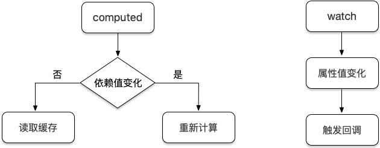

# Vue的编码技巧与规范使用

当我们完成项目的构建，进入开发阶段的时候，除了你需要了解框架本身的知识点外，我们还需要提前掌握一些项目的编码技巧与规范，在根源上解决之后因编码缺陷而导致的项目维护困难、性能下降等常见问题，为项目多人开发提供编码的一致性。

本文将罗列项目中常用的一些编码技巧与规范来帮助大家提升代码质量，并会结合代码片段加强大家的理解与认知。当然不是所有实例都是针对 Vue.js 开发的，有些同样也适用于其他前端项目。

## 实例

### 1. 使用对象代替 if 及 switch

在很多情况下，我们经常会遇到循环判断执行赋值操作的场景，一般我们都会使用 if 及 switch 的条件判断，如果符合则执行赋值，不符合则进入下个判断，比如：

```javascript
let name = 'lisi';
let age = 18;

if (name === 'zhangsan') {
    age = 21;
} else if (name === 'lisi') {
    age = 18;
} else if (name === 'wangwu') {
    age = 12;
}

// 或者
switch(name) {
    case 'zhangsan':
        age = 21;
        break
    case 'lisi':
        age = 18;
        break
    case 'wangwu':
        age = 12;
        break
}
```

这样的写法不仅冗余，而且代码执行效率不高，我们可以使用对象的形式简写：

```javascript
let name = 'lisi';
let obj = {
    zhangsan: 21,
    lisi: 18,
    wangwu: 12
};

let age = obj[name] || 18;
```

以上这种技巧适用于循环判断一次赋值的情况，如果判断过后有较多处理逻辑的还需要使用 if 或 switch 等方法。

### 2. 使用 Array.from 快速生成数组

一般我们生成一个有规律的数组会使用循环插入的方法，比如使用时间选择插件时，我们可能需要将小时数存放在数组中：

```javascript
let hours = [];

for (let i = 0; i < 24; i++) {
    hours.push(i + '时');
}
```

如果使用 Array.from 我们可以简写为：

```javascript
let hours = Array.from({ length: 24 }, (value, index) => index + '时');
```

### 3. 使用 router.beforeEach 来处理跳转前逻辑

在某些情况下，我们需要在路由跳转前处理一些特定的业务逻辑，比如修改路由跳转、设置 title 等，代码如下：

```javascript
import Vue from 'vue'
import Router from 'vue-router'

Vue.use(Router)

// 首页
const Home = (resolve => {
    require.ensure(['../views/home.vue'], () => {
        resolve(require('../views/home.vue'))
    })
})

let base = `${process.env.BASE_URL}`;

let router =  new Router({
    mode: 'history',
    base: base,
    routes: [
        {
            path: '/',
            name: 'home',
            component: Home,
            meta: { title: '首页' }
        },
    ]
})

router.beforeEach((to, from, next) => {
    let title = to.meta && to.meta.title;
    
    if (title) {
        document.title = title; // 设置页面 title
    }
    
    if (to.name === 'home') {
    
        // 拦截并跳转至 page2 单页，$openRouter 方法在第 5 节中封装
        Vue.$openRouter({
            name: 'page2'
        });
    }
    
    next();
})

export default router
```

注意最后需要调用 `next()` 方法执行路由跳转。

### 4. 使用 v-if 来优化页面加载

在 Vue 页面中，一些模块可能需要用户主动触发才会显示，比如弹框组件等这样的子组件，那么我们可以使用 `v-if` 来进行按需渲染，没必要一进页面就渲染所有模块。比如：

```vue
<template>
    <div @click="showModuleB = true"></div>
    <module-b v-if="isShowModuleB"></module-b>
</template>

<script>
import moduleB from 'components/moduleB'
export default {
    data() {
        return {
            isShowModuleB: false
        }  
    },
    components: {
        moduleB
    }
}
</script>
```

这样当 isShowModuleB 为 false 的时候便不会加载该模块下的代码，包括一些耗时的接口调用。当然 v-if 主要适用于代码量较多、用户点击不是很频繁的模块的显示隐藏，同时如果涉及到权限问题的代码都需要使用 v-if，而不是 v-show。

### 5. 路由跳转尽量使用 name 而不是 path

我们前期配置的路由路径后期难免会进行修改，如果我们页面跳转的地方全是使用的 `path`，那么我们需要修改所有涉及该 path 的页面，这样不利于项目的维护。而相对于 path，name 使用起来就方便多了，因为其具有唯一性，即使我们修改了 path，还可以使用原来的 `name` 值进行跳转。

```javascript
this.$router.push({ 
    name: 'page1'
});

// 而不是
this.$router.push({ 
    path: 'page1'
});
```

### 6. 使用 key 来优化 v-for 循环

`v-for` 是 Vue 提供的基于源数据多次渲染元素或模板块的指令。正因为是数据驱动，所以在修改列表数据的时候，Vue 内部会根据 key 值去判断某个值是否被修改，其会重新渲染修改后的值，否则复用之前的元素。

这里如果数据中存在唯一表示 id，则推荐使用 id 作为 key，如果没有则可以使用数组的下标 index 作为 key。因为如果在数组中间插入值，其之后的 index 会发生改变，即使数据没变 Vue 也会进行重新渲染，所以最好的办法是使用数组中不会变化且唯一的那一项作为 key 值。例如：

```vue
<template>
    <ul>
        <li v-for="(item, index) in arr" :key="item.id">{{ item.data }}</li>
    </ul>
</template>

<script>
export default {
    data() {
        return {
            arr: [
                {
                    id: 1,
                    data: 'a'
                },
                {
                    id: 2,
                    data: 'b'
                },
                {
                    id: 3,
                    data: 'c'
                }
            ]
        }
    }
}
</script>
```

### 7. 使用 computed 代替 watch

很多时候页面会出现 `watch` 的滥用而导致一系列问题的产生，而通常更好的办法是使用 `computed` 属性，首先需要区别它们有什么区别：

- watch：当监测的属性变化时会自动执行对应的回调函数
- computed：计算的属性只有在它的相关依赖发生改变时才会重新求值

其实它们在功能上还是有所区别的，但是有时候可以实现同样的效果，而 computed 会更胜一筹，比如：

```
<template>
    <div>
        <input type="text" v-model="firstName">
        <input type="text" v-model="lastName">
        <span>{{ fullName }}</span>
        <span>{{ fullName2 }}</span>
    </div>
</template>

<script>
export default {
    data() {
        reurn {
            firstName: '',
            lastName: '',
            fullName2: ''
        }
    },
    
    // 使用 computed
    computed: {
        fullName() {
            return this.firstName + ' ' + this.lastName
        }
    },
    
    // 使用 watch
    watch: {
        firstName: function(newVal, oldVal) {
            this.fullName2 = newVal + ' ' + this.lastName;
        },
        lastName: function(newVal, oldVal) {
            this.fullName2 = this.firstName + ' ' + newVal;
        },
    }
}
</script>

复制代码
```

上方我们通过对比可以看到，在处理多数据联动的情况下，使用 computed 会更加合理一点。





computed 监测的是依赖值，依赖值不变的情况下其会直接读取缓存进行复用，变化的情况下才会重新计算；而 watch 监测的是属性值， 只要属性值发生变化，其都会触发执行回调函数来执行一系列操作。

### 8. 统一管理缓存变量

在项目中或多或少会使用浏览器缓存，比如 sessionStorage 和 localStorage，当一个项目中存在很多这样的缓存存取情况的时候就会变得难以维护和管理，因为其就像全局变量一样散落在项目的各个地方，这时候我们应该将这些变量统一管理起来，放到一个或多个文件中去，比如：

```
/* types.js */

export const USER_NAME = 'userName';
export const TOKEN = 'token';
```

在需要存取的时候，直接引用：

```javascript
import { USER_NAME, TOKEN } from '../types.js'

sessionStorage[USER_NAME] = '张三';
localStorage[TOKEN] = 'xxx';
```

使用这种方法的好处在于一旦我们需要修改变量名，直接修改管理文件中的值即可，无需修改使用它的页面，同时这也可以避免命名冲突等问题的出现，这类似于 vuex 中 mutations 变量的管理。

### 9. 使用 setTimeout 代替 setInterval

一般情况下我们在项目里不建议使用 `setInterval`，因为其会存在代码的执行间隔比预期小以及 “丢帧” 的现象，原因在于其本身的实现逻辑。很多人会认为 setInterval 中第二个时间参数的作用是经过该毫秒数执行回调方法，其实不然，其真正的作用是**经过该毫秒数将回调方法放置到队列中去**，但是如果队列中存在正在执行的方法，其会等待之前的方法完毕再执行，如果存在还未执行的代码实例，其不会插入到队列中去，也就产生了 “丢帧”。

而 setTimeout 并不会出现这样的现象，因为每一次调用都会产生了一个新定时器，同时在前一个定时器代码执行完之前，不会向队列插入新的定时器代码。

```javascript
// 该定时器实际会在 3s 后立即触发下一次回调
setInterval(() => {
    // 执行完这里的代码需要 2s
}, 1000);

// 使用 setTimeout 改写，4秒后触发下一次回调
let doSometing = () => {
    // 执行完这里的代码需要 2s
    
    setTimeout(doSometing, 1000);
}

doSometing();
```

### 10. 不要使用 for in 循环来遍历数组

大家应该都知道 `for in` 循环是用于遍历对象的，但它可以用来遍历数组吗？答案是可以的，因为数组在某种意义上也是对象，但是如果用其遍历数组会存在一些隐患：其会遍历数组原型链上的属性。

```javascript
let arr = [1, 2];

for (let key in arr) {
    console.log(arr[key]); // 会正常打印 1, 2
}

// 但是如果在 Array 原型链上添加一个方法
Array.prototype.test = function() {};

for (let key in arr) {
    console.log(arr[key]); // 此时会打印 1, 2, ƒ () {}
}
```

因为我们不能保证项目代码中不会对数组原型链进行操作，也不能保证引入的第三方库不对其进行操作，所以不要使用 for in 循环来遍历数组。

## 结语

本文罗列了 10 个项目开发中常见的编码技巧与规范，其实技巧和规范之间本身就是相辅相成的，所以没有分别进行罗列。当然实际的项目开发中存在着很多这样的例子需要大家自己去归纳和整理，比如使用 `name` 来命名你的组件等。如果你有不错的点子，也可以分享在下方的评论区域中供大家学习。

拓展阅读：[前端各类规范集合](https://link.juejin.im/?target=https%3A%2F%2Fgithub.com%2Fecomfe%2Fspec)