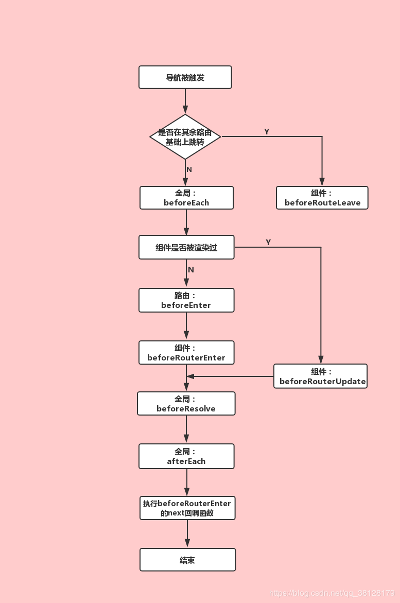

# Vue - 路由守卫（路由的生命周期）

## 路由守卫是什么？

> 官方解释：
>
> > “导航”表示路由正在发生改变。正如其名，vue-router提供的导航守卫主要用来通过跳转或取消的方式守卫导航。有多种机会植入路由导航过程中：全局的, 单个路由独享的, 或者组件级的。
>
> 简单的说，导航守卫就是路由跳转过程中的一些钩子函数。路由跳转是一个大的过程，这个大的过程分为跳转前中后等等细小的过程，在每一个过程中都有一函数，这个函数能让你操作一些其他的事儿，这就是导航守卫。类似于组件生命周期钩子函数

## 路由守卫分类

**【1】全局守卫：**是指路由实例上直接操作的钩子函数，特点是所有路由配置的组件都会触发，直白点就是触发路由就会触发这些钩子函数

- beforeEach（to，from， next）
- beforeResolve（to，from， next）
- afterEach（to，from）

**【2】路由守卫：** 是指在单个路由配置的时候也可以设置的钩子函数

- beforeEnter（to，from， next）

**【3】组件守卫：**是指在组件内执行的钩子函数，类似于组件内的生命周期，相当于为配置路由的组件添加的生命周期钩子函数。

- beforeRouterEnter（to，from， next）
- beforeRouterUpdadte（to，from， next）
- beforeRouterLeave（to，from， next）

## 路由守卫回调参数介绍

to：即将要进入的目标路由对象；

from：即将要离开的路由对象；

next：涉及到next参数的钩子函数，必须调用next()方法来resolve这个钩子，否则路由会中断在这，不会继续往下执行

- next()：进行管道中的下一个钩子。如果全部钩子执行完了，则导航的状态就是confirmed(确认的)。
- next( false )中断当前的导航。如果浏览器的 URL 改变了 (可能是用户手动或者浏览器后退按钮)，那么 URL 地址会重置到from路由对应的地址。
- next( ' / ')或者next({ paht：' / '  })：跳转到一个不同的地址。当前的导航被中断，然后进行一个新的导航。可传递的参数可以是router-link标签中的to属性参数或router.push中的选项
- next( error )：如果传入next的参数是一个Error实例，则导航会被终止且该错误会被传递给router.onError()注册过的回调。

## 路由守卫详解

**【1】全局解析守卫（beforeEach）:** 在路由跳转前触发，这个钩子作用主要是用于登录验证，也就是路由还没跳转提前告知，以免跳转了再通知就为时已晚。

```javascript
const router = new VueRouter({ ... })

router.beforeEach((to, from, next) => {
  // ...
})
```


**【2】全局解析守卫（beforeResolve）:** 这个钩子和beforeEach类似，也是路由跳转前触发，区别是在导航被确认之前，同时在所有组件内守卫和异步路由组件被解析之后，即在 beforeEach 和 组件内beforeRouteEnter 之后，afterEach之前调用。

**【3】全局后置钩子（afterEach）:** 和beforeEach相反，它是在路由跳转完成后触发，它发生在beforeEach和beforeResolve之后，beforeRouteEnter（组件内守卫）之前。这些钩子不会接受next函数也不会改变导航本身

```javascript
router.afterEach((to, from) => {
  // ...
})
```

**【4】路由独享守卫（beforeEnter）:** 和beforeEach完全相同，如果两个都设置了，beforeEnter则在beforeEach之后紧随执行。在路由配置上直接定义beforeEnter守卫

```javascript
const router = new VueRouter({
  routes: [
    {
      path: '/foo',
      component: Foo,
      beforeEnter: (to, from, next) => {
        // ...
      }
    }
  ]
})
```

**【5】组件内的守卫:** 

```vue
<template>
  ...
</template>
<script>
export default{
  data(){
    //...
  },
  beforeRouteEnter (to, from, next) {
    // 在渲染该组件的对应路由被 confirm 前调用
    // 不！能！获取组件实例 `this`
    // 因为当守卫执行前，组件实例还没被创建
  },
  beforeRouteUpdate (to, from, next) {
    // 在当前路由改变，但是该组件被复用时调用
    // 举例来说，对于一个带有动态参数的路径 /foo/:id，在 /foo/1 和 /foo/2 之间跳转的时候，
    // 由于会渲染同样的 Foo 组件，因此组件实例会被复用。而这个钩子就会在这个情况下被调用。
    // 可以访问组件实例 `this`
  },
  beforeRouteLeave (to, from, next) {
    // 导航离开该组件的对应路由时调用
    // 可以访问组件实例 `this`
  }
}
</script>
<style>
  ...
</style>
```

**1. beforeRouterEnter：**该钩子在全局守卫beforeEach和独享守卫beforeEnter之后，全局beforeResolve和全局afterEach之前调用，要注意的是该守卫内访问不到组件的实例，也就是this为undefined。因为它在组件生命周期beforeCreate阶段触发，此时的新组件还没有被创建。在这个钩子函数中，可以通过传一个回调给 next来访问组件实例。在导航被确认的时候执行回调，并且把组件实例作为回调方法的参数。

```javascript
beforeRouteEnter (to, from, next) {
  next(vm => {
    // 通过 `vm` 访问组件实例
  })
}
```

**2. beforeRouterUpdadte：**在当前路由改变时，并且该组件被复用时调用，可以通过this访问实例。

**3. beforeRouterLeave：**导航离开该组件的对应路由时调用，可以访问组件实例this。这个离开守卫通常用来禁止用户在还未保存修改前突然离开。该导航可以通过next( false )来取消。

```javascript
beforeRouteLeave (to, from , next) {
  const answer = window.confirm('Do you really want to leave? you have unsaved changes!')
  if (answer) {
    next()
  } else {
    next(false)
  }
}
```

## 完整的导航解析流程

1. 触发进入其它路由
2. 调用要离开路由的组件守卫**beforeRouterLeave**
3. 调用全局的前置守卫**beforeEach**
4. 在重用的组件里调用 **beforeRouterUpdate**
5. 在路由配置里调用 **beforeEnter**
6. 解析异步路由组件
7. 在将要进入的路由组件中调用**beforeRouteEnter**
8. 调用全局的解析守卫**beforeResolve**
9. 导航被确认
10. 调用全局的后置钩子**afterEach**。
11. 触发 DOM 更新**mounted**。
12. 执行**beforeRouteEnter**守卫中传给 **next**的回调函数。



