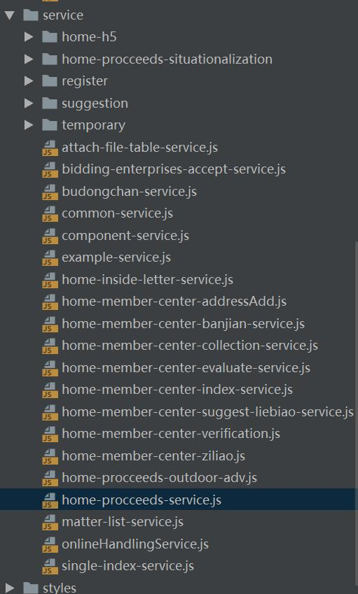

# 项目接口封装方法

## 一.封装接口路径

config.js

```javascript
const config={
  mock_uri: 'http://39.107.52.108:8001/app/mock/30/',
  apiBaseUrl: getEnvURL(),
  api(service, type, mock = false) {
    if (mock) {
      return `${this.mock_uri}${type || service}`;
    }
    switch (type) {
      case 'menu':
        return this.apiBaseUrl + 'pages/user/menus';
      case 'upload':
        return this.apiBaseUrl + 'file/upload'
      case 'down':
        return this.apiBaseUrl + 'rest/download' + service
      default:
        return this.apiBaseUrl + this.prefix + service
    }
  },
}
export default config
```

## 二.封装服务

service.js

```javascript
import axios from 'axios';
import './http';
import config from './config';
import * as _ from 'lodash';
class Service {
    static request(url, params) {
        return request(url, params || {});
    }

    static get(url, params,mock=false) {
        return request(url, {...{ params:params||{}}, ...{method: 'get',mock}});
    }

    static post(url, params,mock=false) {
    	return request(url, {...{ data:params||{}},  ...{method: 'post',mock}});
  	}

    static url(url, type,mock=false) {
       return config.api(url,type,mock);
    }
}
function request(url,params){
  const requestOpts = {
    method: 'post',
  };
  if (params.data) {
    params.data._=Date.now();
    params.data.headers&&(requestOpts.headers = params.data.headers);
  }

  if(appConfig.env==='production'){
    params.mock=false;
  }
  if(params.mock){
    //如果是mock请求,去掉baseURL
    requestOpts.url=_.trim(requestOpts.url,config.baseURL)+'/';
  }

  return axios(_.merge(requestOpts, params, {
    url: Service.url(url,params.type,params.mock)
  }));
}
export default Service;
```

## 三.封装业务接口调用服务

services文件夹为项目统一的接口定义文件夹，下面的js文件应为由页面命名的js文件，文件内容为各页面的接口定义，如图：



```javascript
export default class InstancesService  {
  //note SL0301添加证照信息服务
  static async addApplicationDoc(data) {
    return ServiceRequest.post(`certificate/addApplicationDoc`, data)
    // return ServiceRequest.post('getTemplateData', data, true);
  };
  //note 能力平台 外部系统药监局 资格校验接口
  static async qualificationCheck(data) {
    return ServiceRequest.post(`ability/selectQualificatoryCheck`, data)
    // return ServiceRequest.post('getTemplateData', data, true);
  };
  //note 能力平台 外部系统人社局 身份校验接口
  static async identityCheck(data) {
    return ServiceRequest.post(`ability/identityCheck`, data)
  };
  //note 获取模板数据测试用
  static async getTemplateData(data) {
    return ServiceRequest.get(`${location.origin}/zdpyc/portal/static/data/procceeds/${data.id}-${data.step}.json`);
    // return ServiceRequest.post('getTemplateData', data, true);
  };

  //note 获取页面数据
  static async getPageData(data) {
    return ServiceRequest.post(`certificate/getCertificateInfo`, data)
  }
}
```

## 四.页面中调用接口

```
Service.getTemplateData({id: this.projId, step: this.step}).then(data=>{
	console.log(data);
})
```