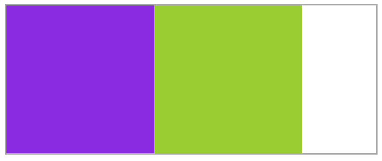
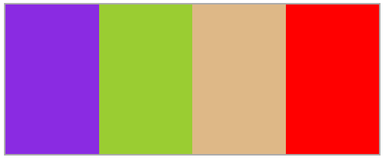
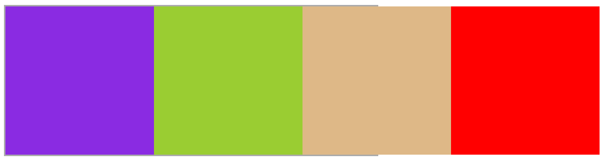
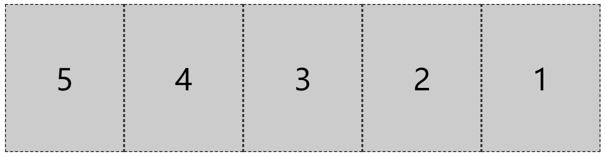
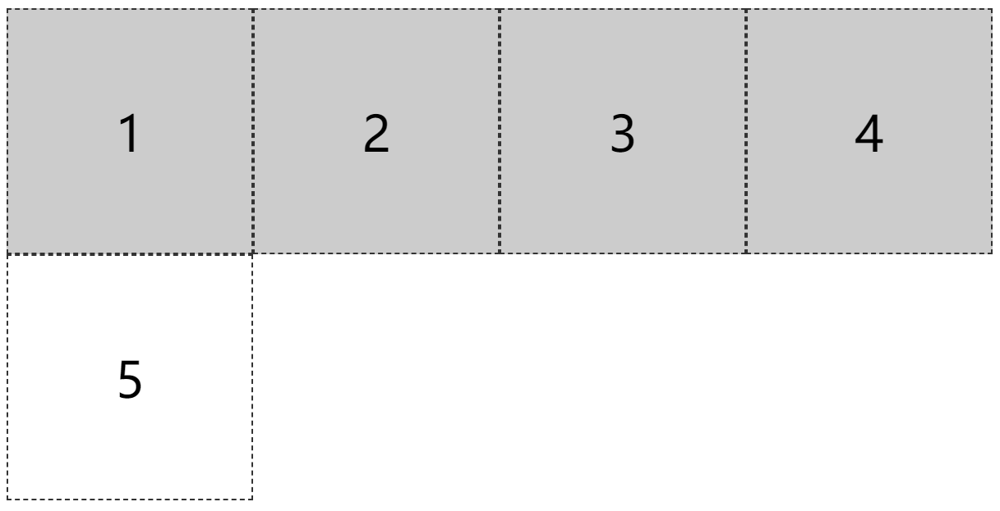
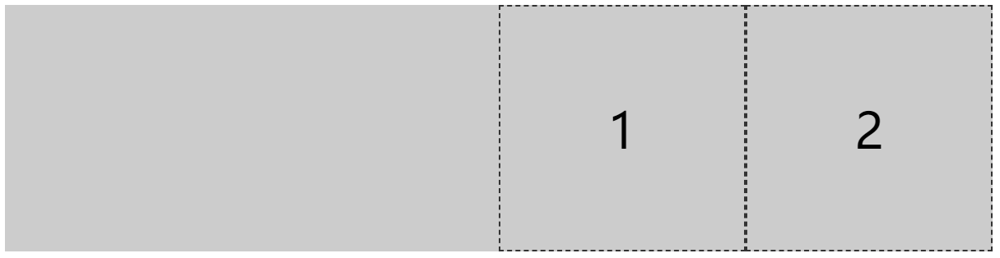

# flex布局

## API

### 容器属性:

- flex-flow
- flex-direction
- flex-wrap
- justify-content
- align-items
- align-content

### 元素属性:

- order
- flex-grow
- flex-shrink
- flex-basis
- flex
- align-self

## 属性详解

对于某个元素只要声明了`display: flex;`，那么这个元素就成为了弹性容器，具有flex弹性布局的特性，里面的元素会像浮动元素一样水平排列，但不会像浮动元素一样脱离文档流。

```html
<style>
	.box{
		display:flex;
		width:500px;
		border:2px solid #aaaaaa;
	}
	.f1{
		width:200px;
		height:200px;
		background-color:blueviolet;
	}
	.f2{
		width:200px;
		height:200px;
		background-color:yellowgreen;           
	}
</style>
<body>
    <div class="box">
        <div class="f1"></div>
        <div class="f2"></div>
    </div>
</body>
```

效果如图：



如果子元素的宽度超出父元素的宽度，则子元素会压缩平均分配宽度占满父元素，如图：



如果想超出父元素，则子元素设置`flex-shrink:0;`元素则会保持原宽度。

```html
<style>
        .box{
            display:flex;
            width:500px;
            border:2px solid #aaaaaa;
        }
        .f1{
            width:200px;
            height:200px;
            background-color:blueviolet;
            flex-shrink:0;  /*保持原宽度*/
        }
        .f2{
            width:200px;
            height:200px;
            background-color:yellowgreen;    
            flex-shrink:0;  /*保持原宽度*/       
        }
        .f3{
            width:200px;
            height:200px;
            background-color:burlywood;  
            flex-shrink:0;   /*保持原宽度*/               
        }
        .f4{
            width:200px;
            height:200px;
            background-color:red;    
            flex-shrink:0;  /*保持原宽度*/       
        }
</style>
```



### flex-direction定义主轴方向

我们可以在弹性容器上通过`flex-direction`修改主轴的方向

```html
<head>
    <meta charset="UTF-8">
    <meta name="viewport" content="width=device-width, initial-scale=1.0">
    <meta http-equiv="X-UA-Compatible" content="ie=edge">
    <title>Document</title>
    <style>
        .f1{
            width:800px;
            height:200px;
            background-color:#cccccc;
            display:flex;
            /* 主轴方向默认为水平从左向右 */
            /* flex-direction:row; */
            /* 主轴方向水平从右往左 */
            flex-direction:row-reverse;
            /* 主轴方向从上往下 */
            /* flex-direction:column; */
            /* 主轴方向从下往上 */
            /* flex-direction:column-reverse; */
        }
        .item{
            width:200px;
            height:200px;
            border:1px dashed #333333;
            box-sizing:border-box;
            font-size:40px;
            text-align:center;
            line-height:200px;
        }
    </style>
</head>
<body>
    <div class="f1">
        <div class="item">1</div>
        <div class="item">2</div>
        <div class="item">3</div>
        <div class="item">4</div>
        <div class="item">5</div>
    </div>
</body>
```



### flex-wrap主轴元素换行

```html
<head>
    <meta charset="UTF-8">
    <meta name="viewport" content="width=device-width, initial-scale=1.0">
    <meta http-equiv="X-UA-Compatible" content="ie=edge">
    <title>Document</title>
    <style>
        .f1{
            width:800px;
            height:200px;
            background-color:#cccccc;
            display:flex;
            /* 主轴方向默认为水平从左向右 */
            flex-direction:row;
            /* flex默认的里面的子元素是不换行，当超出时会压缩 */
            /* wrap为超出换行 */
            /* wrap-reverse为反向折行 */
            flex-wrap:wrap;
        }
        .item{
            width:200px;
            height:200px;
            border:1px dashed #333333;
            box-sizing:border-box;
            font-size:40px;
            text-align:center;
            line-height:200px;
        }
    </style>
</head>
<body>
    <div class="f1">
        <div class="item">1</div>
        <div class="item">2</div>
        <div class="item">3</div>
        <div class="item">4</div>
        <div class="item">5</div>
    </div>
</body>
```



### justify-content

```html
<head>
    <meta charset="UTF-8">
    <meta name="viewport" content="width=device-width, initial-scale=1.0">
    <meta http-equiv="X-UA-Compatible" content="ie=edge">
    <title>Document</title>
    <style>
        .f1{
            width:800px;
            height:200px;
            background-color:#cccccc;
            display:flex;
            /* 主轴方向默认为水平从左向右 */
            flex-direction:row;
            /* 项目在主轴上默认为靠近起点 */
            /* justify-content:flex-start; */
            /* 项目在主轴上居中 */
            justify-content:center;
            /* 项目在主轴上靠近终点 */
            justify-content:flex-end;
        }
        .item{
            width:200px;
            height:200px;
            border:1px dashed #333333;
            box-sizing:border-box;
            font-size:40px;
            text-align:center;
            line-height:200px;
        }
    </style>
</head>
<body>
    <div class="f1">
        <div class="item">1</div>
        <div class="item">2</div>
    </div>
</body>
```

